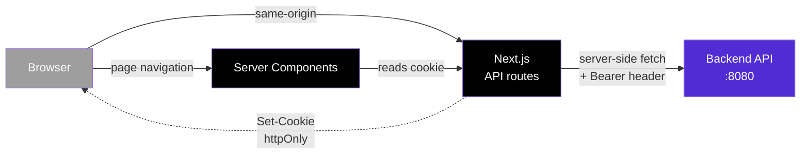

# FamilyCare Web 🏥

[](https://nextjs.org/)
[](https://www.typescriptlang.org/)
[](https://tailwindcss.com/)
[](https://ui.shadcn.com/)
[](https://tanstack.com/query)

> Web frontend for **FamilyCare**, a family health and well-being platform.
> Built with **Next.js 15 App Router**, **TypeScript**, **shadcn/ui**, and **TanStack Query**.
>
> 🔗 Backend repository: [familycare-backend](https://github.com/viniciusst/familycare-backend)

---

## ✨ Highlights

- ⚡ **Next.js 15** with App Router and React Server Components
- 🎨 **shadcn/ui + Tailwind CSS** for a modern, accessible UI
- 🔒 **httpOnly cookies** for token storage (XSS-proof) with automatic refresh rotation
- 🛡️ **Edge middleware** for route protection (zero-latency auth gate)
- 📦 **TanStack Query** for server-state caching, refetching, and optimistic updates
- 📝 **react-hook-form + zod** for typed, validated forms with shared schemas
- 🌗 **Light / dark / system** theme toggle from day one
- 🔁 **Same-origin API proxy** — browser never sees the backend URL or raw tokens

---

## 🎬 Quick start

```bash
# 1. Install dependencies
npm install

# 2. Copy environment variables
cp .env.example .env.local
# Edit .env.local and set BACKEND_API_URL to your running FamilyCare API

# 3. Make sure the backend is running
# In another terminal: docker compose up -d  (inside familycare-backend)

# 4. Start the dev server
npm run dev
```

Open [http://localhost:3000](http://localhost:3000) — you should be redirected to `/login`.

---

## 🏗️ Architecture



### Why a proxy?

The browser never talks directly to the backend. Every API call goes through `/api/*` route handlers in Next.js, which:

1. Read the httpOnly cookie (which the browser can't access via JS)
2. Forward the token to the backend as a `Bearer` header
3. Translate the response back, including rotating cookies on refresh

This means:
- ✅ Tokens are **XSS-proof** (httpOnly)
- ✅ Backend URL is **never exposed** to the browser
- ✅ CORS is **not a concern** (same-origin)
- ✅ Token refresh is **transparent** to client code

---

## 📂 Project structure

```text
familycare-frontend/
├── src/
│   ├── app/
│   │   ├── (auth)/                    ← Public route group
│   │   │   ├── layout.tsx
│   │   │   ├── login/page.tsx
│   │   │   └── register/page.tsx
│   │   ├── (app)/                     ← Authenticated route group
│   │   │   ├── layout.tsx             ← Sidebar + header
│   │   │   ├── dashboard/page.tsx
│   │   │   └── profile/page.tsx
│   │   ├── api/auth/                  ← Server-side proxy
│   │   │   ├── login/route.ts
│   │   │   ├── register/route.ts
│   │   │   ├── refresh/route.ts
│   │   │   ├── logout/route.ts
│   │   │   └── me/route.ts
│   │   ├── layout.tsx                 ← Root layout (providers)
│   │   └── page.tsx                   ← Landing redirect
│   ├── components/
│   │   ├── ui/                        ← shadcn/ui primitives
│   │   ├── forms/                     ← LoginForm, RegisterForm
│   │   ├── layout/                    ← Sidebar, Header, UserMenu, ThemeToggle
│   │   └── providers/                 ← ThemeProvider, QueryProvider
│   ├── hooks/
│   │   └── use-me.ts                  ← TanStack Query hook for current user
│   ├── lib/
│   │   ├── api/                       ← backend.ts (server), client.ts (browser)
│   │   ├── auth/                      ← Session cookie helpers
│   │   ├── schemas/                   ← Shared Zod schemas
│   │   └── utils.ts                   ← cn() utility
│   ├── types/
│   │   └── api.ts                     ← Shared types mirroring backend contracts
│   └── middleware.ts                  ← Edge route protection
├── public/
├── .env.example
└── package.json
```

---

## 🧰 Tech stack

| Concern | Choice | Why |
|---|---|---|
| Framework | Next.js 15 (App Router) | Server Components reduce client JS, file-system routing, edge middleware |
| Language | TypeScript | Compile-time safety, matches backend's strongly-typed style |
| Styling | Tailwind CSS 4 | Utility-first, atomic CSS, no specificity wars |
| Components | shadcn/ui | Copy-paste primitives, full ownership, fully customizable |
| Forms | react-hook-form + zod | Tiny, fast, with type inference from schemas |
| Server state | TanStack Query | Cache, refetch, retry, devtools, industry standard |
| Theme | next-themes | Light/dark/system, SSR-safe, no flash |
| Notifications | Sonner | Beautiful toast notifications, accessible |
| Icons | lucide-react | Tree-shakeable, consistent stroke width |

---

## 🚧 Roadmap

- [x] Phase 2A — Foundation + Auth (login, register, dashboard placeholder)
- [ ] Phase 2B — Family management (create, invite, accept, members)
- [ ] Phase 2C — Medical history (appointments, exams, vaccines, allergies, conditions)
- [ ] Phase 2D — Privacy rules, profile editing, polish
- [ ] Deployment

---

## 📄 License

MIT

---

## 👤 Author

**Vinicius Silva Teixeira** — Principal Software Architect
[LinkedIn](https://linkedin.com/in/vinicius-silva-teixeira-09000032) · [GitHub](https://github.com/viniciusst)
